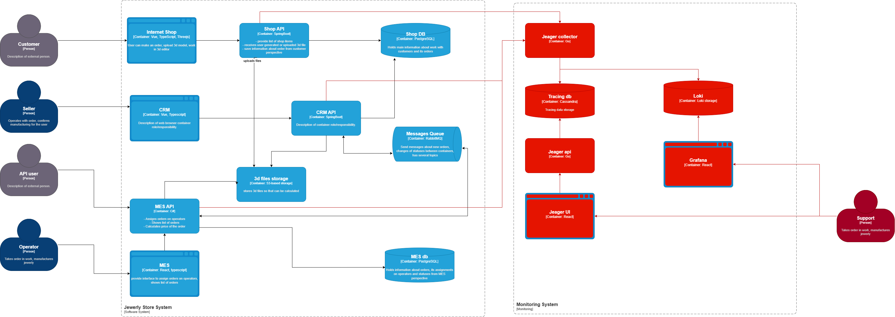
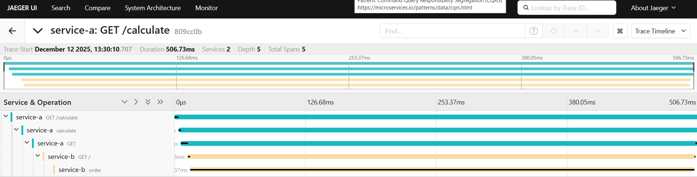

# Архитектурное решение по трейсингу

## Мотивация
1) Повышение наблюдаемости системы поможет быстрее решить возникающие проблемы.
2) Визуализация прохождения запроса поможет при оптимизации системы.
3) Трейсинг даст данные, которые помогут более предсказуемо вносить изменения в систему.
4) Быстрое решение проблем позволит повысить качество предоставляемого клиентам сервиса.

## Предлагаемое решение

Добавляем трейсинг для входящих и исходящих запросов в сервисы.
В трейсинг должен попасть id заказа и логин пользователя/название сервиса инициировавшего действие.

## Компромиссы
Для передачи контекста трейсинга через заголовки RabbitMQ придется доработать отправку и получение сообщений.

## Безопасность
Атрибуты терйса не должны содержать конфиденциальных данных.
Хранилище данных трейсинга должно быть защищено шифрованием, как и передача его в хранилище.
Для доступа к данным трейсинга следует выделить новую роль "Поддержка" и разрешить доступ сотрудников только с этой
ролью.

## Трейсинг с OpenTelemetry и Jaeger

