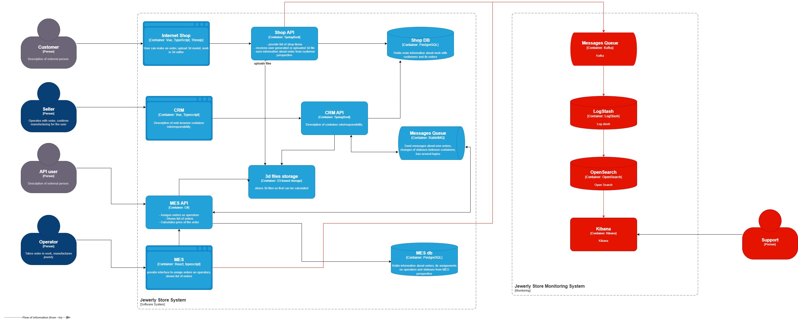

# Архитектурное решение по логированию

## Анализ
Логирование с уровнем INFO:
1) Изменение статуса заказа: время, идентификатор покупателя, номер заказа, логин сотрудника, работающего с заказом.
2) HTTP запросы в другие сервисы, отправка сообщений: время, основные атрибуты запроса с маскированием ПД.
3) Входящие запросы HTTP, чтение сообщений: время, основные атрибуты запроса с маскированием ПД.
4) Выполнение расчета стоимости: время, длительность расчета, номер заказа, стоимость.

## Мотивация
В первую очередь стоит добавить сбор логов в системы Shop API и MES, так как в них проблемнее всего получить информацию
от пользователей об ошибке. В CMS работаю сотрудники компании и им можно дать инструкцию как сообщить о проблеме,
передав и описав наиболее полно возникшую проблему.

## Предлагаемое решение

Для сбора логов будет использоваться ELK стек, поэтому необходимо будет развернуть LogStash и OpenSearch,
а так же filebeat и Kibana. 
filebeat разворачивается как sidecar в контейнерах систем MES и store api
В логах не должны присутствовать ПД, их следует маскировать. 

## Анализ логов 
Для анализа будем использовать Grafana.
