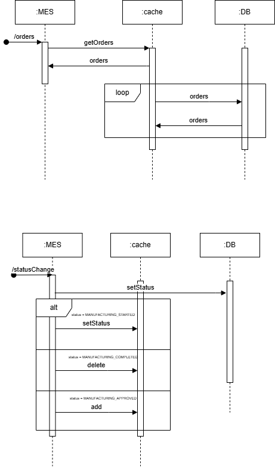

# Архитектурное решение по кешированию

Кеширование дует добавлено при запросах к БД.

## Мотивация
Кеширование списка активных заказов позволит ускорить загрузки страницы со
списком заказов и операторы смогут быстрее брать в работу новые заказы.

## Предлагаемое решение

Предполагается использовать write-through кэширование, те обновлять кеш одновременно с записью в БД.
Таким образом чтение списка новых заказов в статусах MANUFACTURING_* будет всегда возвращать актуальный список заказов. 
При появлении заказа в статусе MANUFACTURING_APPROVED добавляем его в кеш.
При обновлении статуса на MANUFACTURING_STARTED меняем статус в бд и в кэше.
Когда заказ переходит в статус MANUFACTURING_COMPLETED выкидываем его из кеша по ключу.

Следует учесть, что в системе могут происходить сбои. Для этого стоит применить паттерн Refresh-Ahead и периодически
обновлять кэш через запрос в БД.

Cache-Aside в данном случае не подойдет, так как нам необходимо читать список заказов по статусам, а не по id.

